# WORKERS GENERAL SAFETY QUIZ

Health and safety laws apply to all employers, self-employed people and employees in their workplaces. This includes fixed-term employees and temporary employees.

### Risk assessment and safety statement
 Every employer must carry out a workplace risk assessment to:
 * Identify any hazards in the workplace
 * Assess the risks arising from such hazards
 * Identify the steps to be taken to deal with any risks

 The purpose of this website is to promote the employer must also prepare a safety statement, based on the risk assessment. The statement should include details of people in the workforce who are responsible for safety issues. Employees should have access to this statement and employers should review it regularly.

A live website can be found [here](https://vinuc49.github.io/Safety-Quiz/).

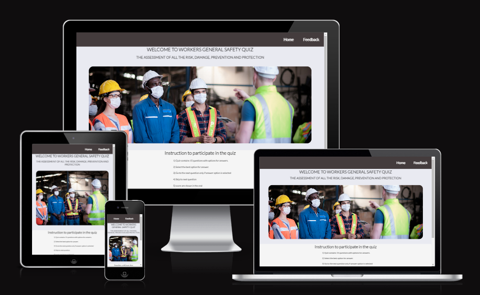

## Features

 ### General

 * Responsive design across all device sizes.
 * Similar color scheme and design throughout all pages to effectively structure, categorise and present the information to the users.

 ### Header

  

 * The header contains the fully responsive navigation bar positioned across the top  right of the screen.

 * The navigation bar is identical in all pages and contains links to all pages to facilitate navigation across the site. It also has a hover effect that changes color to  
   provide feedback to the customer for a better user experience.

 ### Footer

  

  * The footer Contains a link to the business' social media channels.

### Home Page

* **Main image**

  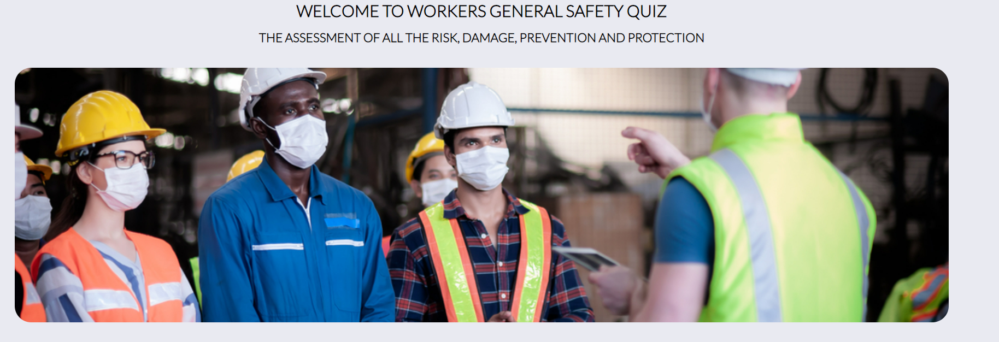

   - An image of providing instruction to the employees is included with a focus to attract the attention of the user. 

* **Instruction to Quiz**

  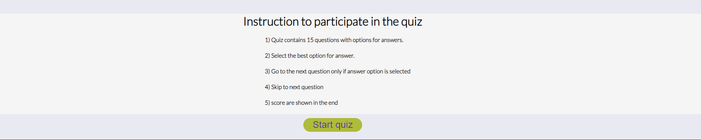

   - Contains a text provides instruction to the quiz and below that a button "start quiz" is given to direct the user to the quiz page.

### Quiz Page

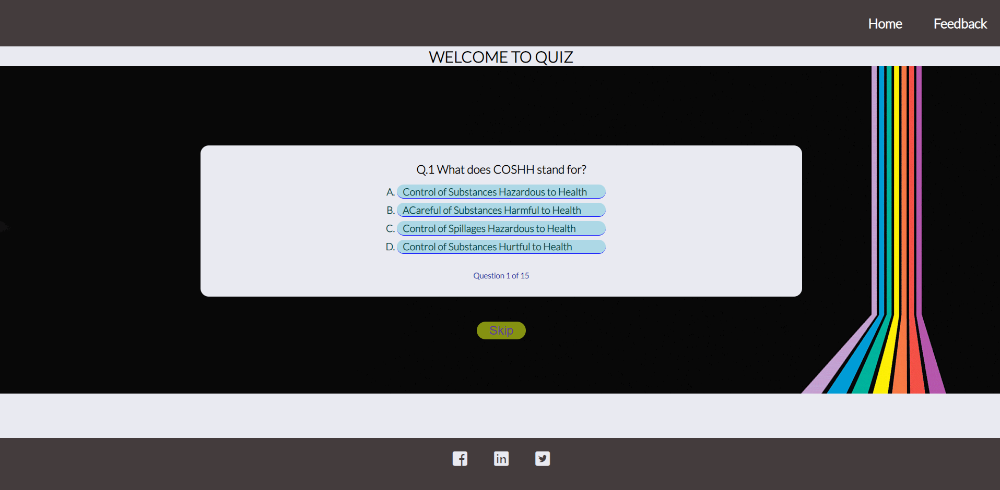

 -  The section contains question banks. The page has question with 3 to 4 options to select answer. The page also has skip button. Once the user click the skip button, the next question will appear until it reach to question 15.

 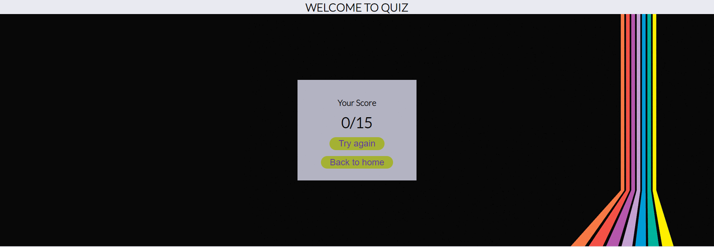

 -  After completing 15 questions, a score box will appear. that will highlight the users on how many answers are correct. below that a try again button which will redirect the user to question bank 1 and a Back to home button which will redirect the user to hoome page.

### Feedback Page

 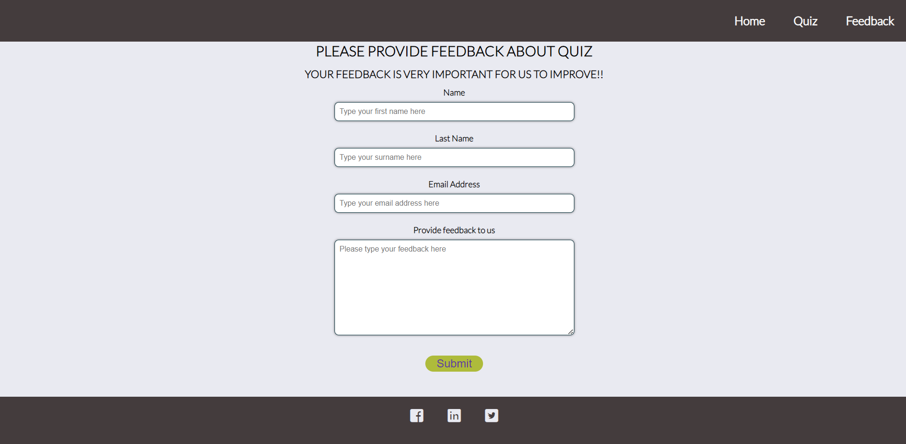

 - Include feedback form that provides the user the ability to provide comments and feedback about the quiz and a Submit buttons.
 - The form use the method="POST" action="https://formdump.codeinstitute.net/"
 - I use the option of placeholder for full name and email address.
 - If the user tries to submit the form without any message a pop up will appear to alert user to provide feedback.

[Back to top ⇧](#WORKERS-GENERAL-SAFETY-QUIZ) 

## Technologies Used

### Languages Used
* [HTML5](https://en.wikipedia.org/wiki/HTML5)
* [CSS3](https://en.wikipedia.org/wiki/CSS)
* [JavaScript](https://en.wikipedia.org/wiki/JavaScript)

### Frameworks, Libraries and Programs Used

* [Google Fonts](https://fonts.google.com/)
    - Google Fonts was used to import the fonts oswald and lotto into the style.css file. These fonts were used throughout the site.

* [Font Awesome](https://fontawesome.com/)
     - Font Awesome was used throughout all pages to add icons in order to create a better visual experience for UX purposes.

* [photopea](https://www.photopea.com/)
    - Photopea was used to reduce the file size of the images for the website.

* [GitPod](https://gitpod.io/)
     - GitPod was used for writing code, committing, and then pushing to GitHub.

* [GitHub](https://github.com/)
     - GitHub was used to store the project after pushing.

* [Balsamiq](https://balsamiq.com/)
     - Balsamiq was used to create the wireframes during the design phase of the project.

* [Am I Responsive?](http://ami.responsivedesign.is/#)
    - Am I Responsive was used in order to see responsive design throughout the process and to generate mockup imagery to be used.

* [Chrome DevTools](https://developer.chrome.com/docs/devtools/)
    - Chrome DevTools was used during development process for code review and to test responsiveness.

* [W3C Markup Validator](https://validator.w3.org/)
    - W3C Markup Validator was used to validate the HTML code.

* [W3C CSS Validator](https://jigsaw.w3.org/css-validator/)
    - W3C CSS Validator was used to validate the CSS code.

* [Jshint Validator](https://jshint.com/) 
    - was used to validate JavaScript code used in the proejct.

# Testing

## Testing using tools
### Google Developer Tools
Google developer tools (Chrome DevTools) was used as debugging tools. Every elements that was added in HTML CSS style and Javascript was inspected and debugged until I was happy with. Once satisfied, the code was copied from Chrome DevTools and paste in the CSS style sheet.

### Responsive Tools

In order to make sure that design web pages are responsive to all device sizes, [Am I Responsive](http://ami.responsivedesign.is/) site was used to check it. 

### W3C Validator Tools

[W3C Markup](https://validator.w3.org/#validate_by_input+with_options) was used to check for any errors within my HTML pages.

 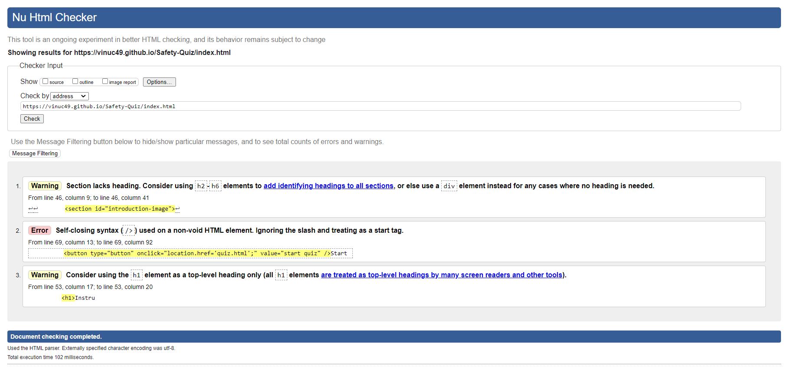

 - W3C Markup Validator found an warning concerning Section lacks heading. The section tag was replaced for a div tag to correct this. 

 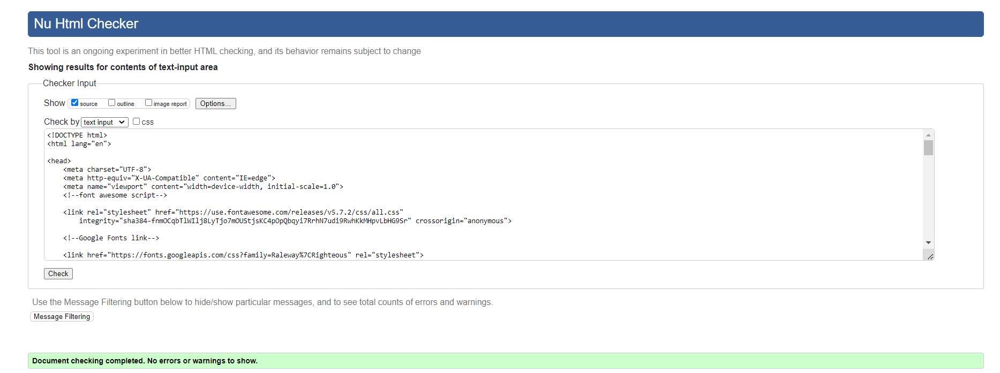
       
[W3C CSS Validation](https://jigsaw.w3.org/css-validator/) found no errors or warnings on my CSS.
  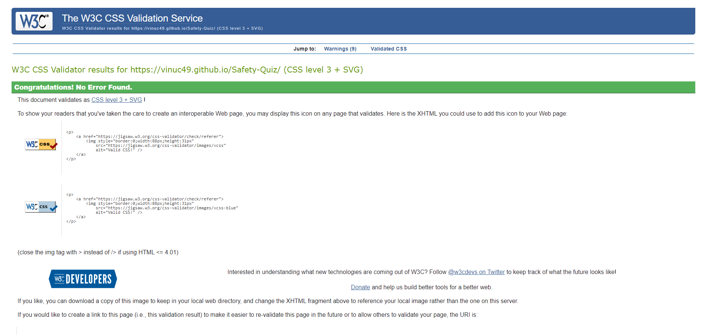

  [Jshint validation](https://jshint.com/) was used to validate JavaScript code used in the proejct.
 - It identified error which is missing semicolons in many lines
 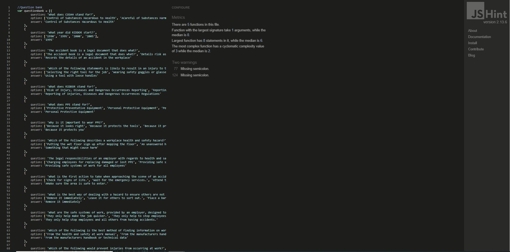
 - The identified error was corrected by adding semicolon in the JS code.
 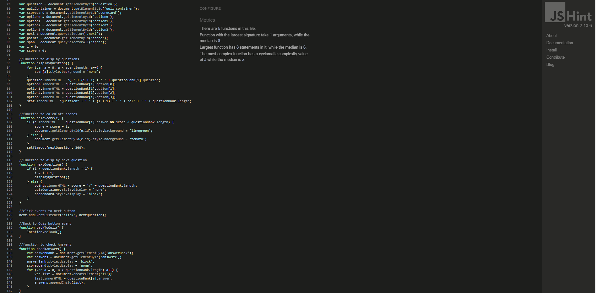

## Manual Testing

I have tested my site on multiple devices. These include:
  - Galaxy S5 (360 x 640)
  - iPhone 6/7/8 (375 x 667) 
  - iPhone 6/7/8 plus (414 x 736)
  - ipad (768 x 1024)
  - iPhone XS Max
  - iPad Pro (1024 x 1366)
  - Huawei P20 Pro
  - HP laptop (1980 x1080)

## Accessibility

 * Used Lighthouse in Chrome DevTools to confirm that the colors and fonts being used in throughout the website are easy to read and accessible.

 * Lighthouse reports

    - **Home Page**

    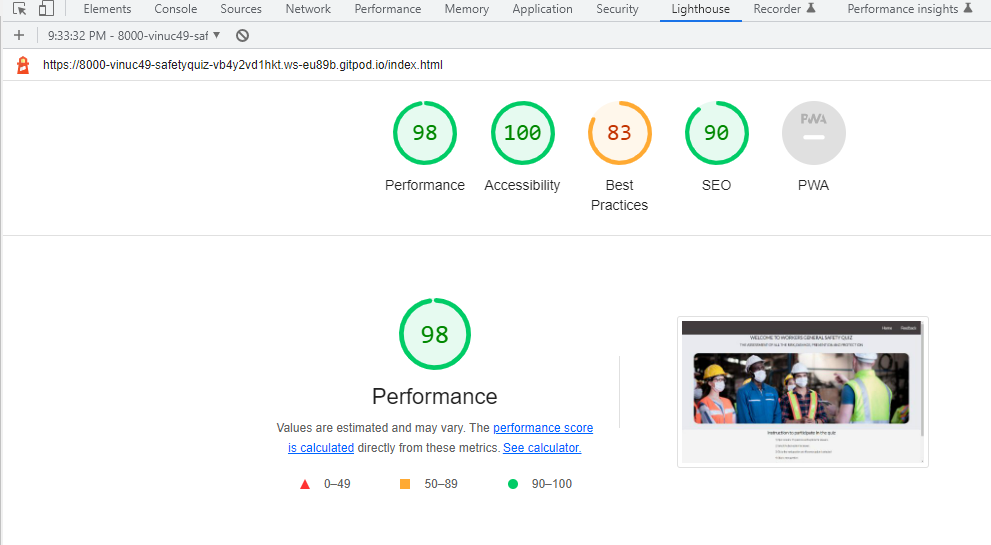

    - **quiz Page**

    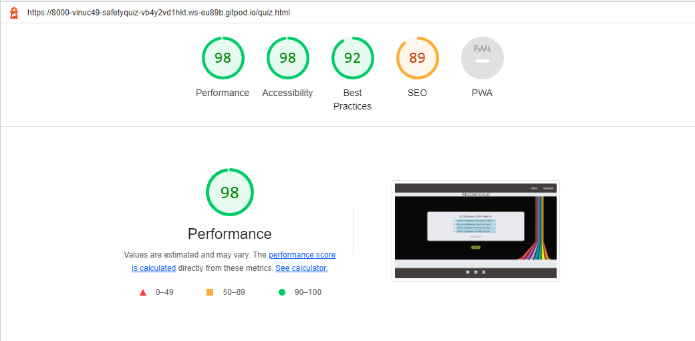

    - **feedback Page**

    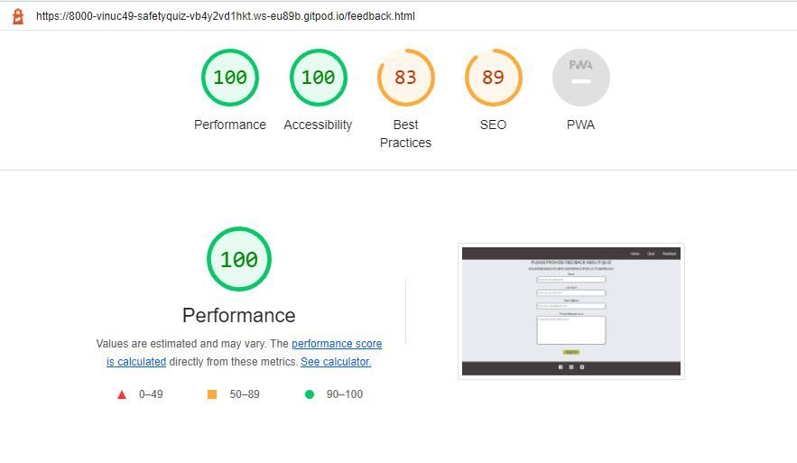

## All 3 pages:
 
 - **Navigation Bar**

            - Hovering on the different navigation bar's links will trigger hover effect, highlighting the link for the users.

            - Clicking on the navigation bar's links will bring the users to the specified page.
        
- **Footer**
        
            - Clicking on the social media links will open the specific website on a new tab.

# Deployment

* This website was developed using [GitPod](https://www.gitpod.io/), which was then committed and pushed to GitHub using the GitPod terminal.

### GitHub Pages

* Here are the steps to deploy this website to GitHub Pages from its GitHub repository:

    1. Log in to GitHub and locate the [GitHub Repository](https://github.com/vinuc49/Safety-Quiz).

    2. At the top of the Repository, locate the Settings button on the menu.

    3. Scroll down the Settings page until you locate the Pages section.

    4. Under Source, click the dropdown called None and select Master Branch.

    5. The page will refresh automatically and generate a link to your website.

Visit the deployed website [here](https://vinuc49.github.io/Safety-Quiz/).

## Credits 

### Media

* [Google images](https://www.google.com/imghp?hl=EN)

    - For all images used in the website

### Code

* The code to make the social media links and font color code was taken from the CI **love running** project 
* [Stack Overflow](https://stackoverflow.com/) and [W3Schools](https://www.w3schools.com/) were consulted on a regular basis for inspiration and sometimes to be able to better understand the code being implement.

## Acknowledgements

* I would like to thank my tutor, Marcel, for his constructive feedback and guidance.

* Code Institute for providing great course content and necessary information to complete this project.

* I would like to thank my friend and partner, for their ideas and support through out the project.